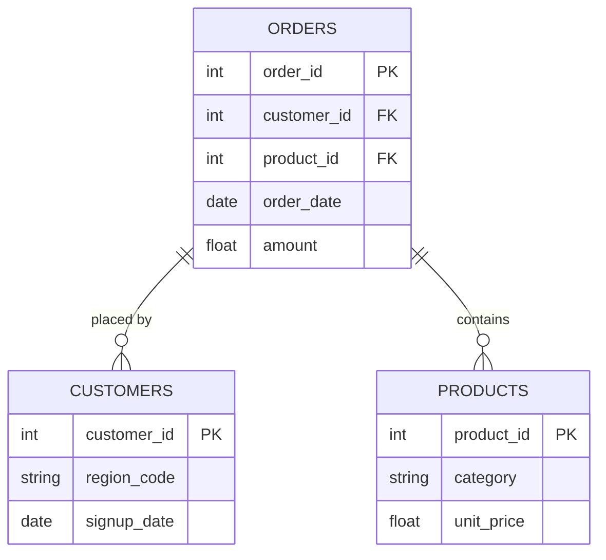

# CHINOOK MUSIC STORE - Customer & Revenue Analysis
> *SQL-based analysis of a digital music store's customer and invoice data to answer questions on customer distribution, spending behaviour, and revenue trends using MySQL.*

---

## ⚙️ Project Type Flags
> *Check what applies. This helps reviewers and collaborators understand the nature of the work at a glance. Delete this block before publishing.*

- [ ] Exploratory Data Analysis (EDA)
- [x] SQL Analysis / Querying
- [ ] Dashboard / Data Visualization
- [ ] Data Pipeline / ETL
- [ ] Predictive Modelling / Machine Learning
- [x] Data Cleaning / Wrangling
- [ ] End-to-End (multiple of the above)
- [ ] Other: ___________

---

## Table of Contents
1. [Project Overview](#1-project-overview)
2. [Key Questions Answered](#2-Key Questions Answered)
3. [Objectives](#2-objectives)
4. [Project Scope & Tools](#4-project-scope--tools)
5. [Repository Structure](#5-repository-structure)
6. [Data Workflow](#6-data-workflow)
7. [Data Model & Schema](#7-data-model--schema)
8. [SQL Analysis & Queries](#8-SQL Analysis & Queries)
9. [Key Insights](#9-key-insights)
10. [Recommendations](#10-recommendations)
11. [Deliverables](#11-deliverables)
12. [Author](#12-author)

---

## 1. Project Overview

**Context:** Chinook is a sample digital music store database. The store needed a clear picture of where its customers are located, how much they spend, and how revenue trends over time.

**Problem Statement:** The Customer and Invoice tables held raw transactional and customer data, but there was no structured analysis answering key customer and revenue questions — such as which country has the most customers, who the highest-spending customers are, and which customers have never purchased anything.

**Approach:** Used SQL in MySQL Workbench to query the Customer and Invoice tables, writing queries using INNER and LEFT JOINs, correlated subqueries, HAVING clauses, and the RANK() window function to answer nine business questions.

**Outcome:** Successfully extracted customer and revenue insights, identifying the country with the largest customer base, USA-based customers, countries with multiple customers, top-spending customers, average invoice value, inactive customers, above-average spenders, ranked spenders, and month-by-month revenue trends.
---

## 2. Key Questions Answered
Which country has the largest customer base?
Which customers are from the USA?
Which countries have more than one customer?
Which customers have spent the most money at the music store?
What is the average amount customers spend per invoice?
Which customers have never made a purchase?
Which customers have spent more than the average customer spending?
Who are the top-spending customers, ranked by total amount spent?
How has store revenue changed over time?

---

## 3. Objectives
Primary Objective: 
Secondary Objective 1: 
Secondary Objective 2:
Secondary Objective 3:
- **Primary Objective:** Write and execute SQL queries in MySQL Workbench to analyze the Chinook Customer and Invoice tables and extract meaningful customer and revenue insights.
- **Secondary Objective 1:** Identify customer geographic distribution, including country with the largest base and countries with multiple customers.
- **Secondary Objective 2:**  Determine top-spending customers and customers with no purchase history using joins.
- **Secondary Objective 3:**  Identify customers spending above the average using correlated subqueries.
- **Secondary Objective 4:**  Demonstrate practical SQL skills including joins, subqueries, window functions, and date-based trend analysis.

---

## 4. Project Scope & Tools

### Scope

| Dimension | Details |
|-----------|---------|
| **In Scope** | Customer records (name, country) and Invoice records (total, invoice date) from the Chinook sample database |
| **Out of Scope** | Track-level, artist-level, and playlist-level data — analysis is limited to the Customer and Invoice tables|
| **Time Period** | Full invoice date range present in the Chinook database|
| **Granularity** | Row-level customer and invoice data|

### Tools & Technologies

| Category | Tool(s) Used |
|----------|-------------|
| Category| MySQL |
| Database Management | MySQL Workbench |
| Data Querying| SQL (SELECT, WHERE, GROUP BY, HAVING, ORDER BY |
| Joins | INNER JOIN, LEFT JOIN |
| Subqueries | Correlated / nested subqueries |
| Aggregate Functions| COUNT, SUM, AVG, ROUND|
| Date Functions| YEAR, MONTH |
| String Functions | CONCAT | 
| Documentation | Microsoft Word, GitHub

---

## 5. Repository Structure

```
Chinook-Music-Store-SQL-Analysis/
│
├── data/
│   └── raw/                 # Chinook sample database (Customer, Invoice tables)
│
├── docs/                     # Data dictionary and project notes
│
├── queries/
│   ├── exploratory/          # Initial investigative queries
│   └── final/                # Final production-ready queries
│
├── reports/                  # Written summary report
│
├── visuals/                  # Screenshots of query results
│
├── README.md                 # You are here
└── project_metadata.yml      # Project metadata
```

---

## 6. Data Workflow

1. **Source:** Two related tables from the pre-built Chinook sample database — Customer (customer records) and Invoice (transaction records).
2. **Ingestion:** Chinook database connected in MySQL Workbench; Customer and Invoice tables queried directly.
3. **Analysis:** Wrote and executed 9 SQL queries covering aggregation, joins (INNER and LEFT), correlated subqueries, HAVING clauses, and RANK() window functions to answer key customer and revenue questions.
4.  **Output:**  Query results documented in README, SQL script saved as a .sql file, selected screenshots of query outputs saved in the visuals/ folder, and a written summary report saved in the reports/ folder.
   
---

## . Data Model & Schema
The dataset uses two core tables from the Chinook sample database.
Data Dictionary

### Dataset Dictionary 

| Field Name | Data Type | Description | Example Value |
|------------|-----------|-------------|---------------|
| `CustomerId` | Integer | Unique identifier for each customer | 1 |
| `[FirstName` | Text | Customer's first name | Luís |
| `LastName` |Text| Customer's last name| Gonçalves |
| `Country` | Text | Customer's country | Brazil |
| `InvoiceId` | Integer | Unique identifier for each invoice | 1 |
| `CustomerId (Invoice)` | Integer | Foreign key linking invoice to customer | 1 |
| `InvoiceDate]` | Date| Date the invoice was issued| 2009-01-01 |
| `Total` | Float| Total amount of the invoice | 1.98|

> **Key tables:** Customer, Invoice
> **Relationship:** Customer.CustomerId → Invoice.CustomerId


---

## 7. ERD - Entity Relationship Diagram
### *(Primarily for SQL Projects - remove this section if not applicable)*

<!--
  An ERD shows how your tables connect to each other visually.
  It is the fastest way for a reviewer to understand the data structure
  of a SQL project without reading every query.

  HOW TO INCLUDE YOUR ERD:
  Option A - Image embed (most common):
    Export your ERD from dbdiagram.io, DBeaver, Lucidchart, or similar.
    Save to /visuals/erd.png and reference it below.

  Option B - dbdiagram.io code block (version-controllable):
    Paste your schema definition code directly in the fenced block below.
    Anyone can paste it into dbdiagram.io to regenerate the visual.

  Option C - Mermaid diagram (renders natively in GitHub):
    Use the mermaid code block syntax below.
    GitHub will render this as a diagram automatically.

  PICK ONE. Don't use all three. Delete the options you don't use.
-->

### Option A - Embedded Image

*[Brief caption: e.g., "Three-table schema - orders, customers, and products joined on shared IDs."]*

---

### Option B - dbdiagram.io Schema Definition
```
Table orders {
  order_id    int     [pk]
  customer_id int     [ref: > customers.customer_id]
  product_id  int     [ref: > products.product_id]
  order_date  date
  amount      float
}

Table customers {
  customer_id int  [pk]
  region_code string
  signup_date date
}

Table products {
  product_id   int    [pk]
  category     string
  unit_price   float
}
```
*Paste this into [dbdiagram.io](https://dbdiagram.io) to view the visual.*

---

### Option C - Mermaid Diagram *(renders on GitHub)*


---

**Table Relationships Summary:**

| Relationship | Join Key | Type |
|-------------|----------|------|
| `orders` → `customers` | `customer_id` | Many-to-One |
| `orders` → `products` | `product_id` | Many-to-One |
| [Add rows as needed] | | |

---

## 8. Analysis & Metrics

<!--
  Explain what you measured and how - before you share what you found.

  WHAT GOOD LOOKS LIKE:
  Metric: "Customer Return Rate"
  Definition: "Number of transactions flagged as returns divided by total
               transactions, calculated at product-category and regional grain."
  Why It Matters: "Return rate - not sales volume - was hypothesised to
                  explain regional revenue gaps. This metric tests that hypothesis."

  WHAT TO AVOID:
  ❌ Defining a metric only in code: SUM(returns) / COUNT(transaction_id)
     That's an implementation. Write the plain-language definition here.
     Both belong in your project - the definition in the README,
     the implementation in the code.
-->

### Analytical Approach

[Describe how you approached the analysis. Were you exploring patterns? Testing a hypothesis? Building and validating a pipeline? Be honest about your method - exploratory work is valid, just call it that.]

### Key Metrics Defined

| Metric | Plain-Language Definition | Why It Matters |
|--------|--------------------------|----------------|
| `[Metric 1]` | [What it measures, in one sentence] | [What decision or question it answers] |
| `[Metric 2]` | [What it measures, in one sentence] | [What decision or question it answers] |
| `[Metric 3]` | [What it measures, in one sentence] | [What decision or question it answers] |

### Methods Used

- [e.g., Descriptive statistics - distribution, central tendency, outlier detection]
- [e.g., Trend analysis across [time period]]
- [e.g., Segmentation / group comparison by [dimension]]
- [e.g., Correlation analysis between [variable A] and [variable B]]
- [e.g., SQL window functions for [specific aggregation]]
- [e.g., Custom aggregation or transformation logic in [tool]]

---

## 9. Key Insights

<!--
  Findings + implications. Not just what happened - what it means.

  WHAT GOOD LOOKS LIKE:
  ✅ "Return rates, not sales volume, explain Region A's underperformance.
      Region A's return rate on home goods was 34% - more than double the
      company average. Revenue was not lost at the point of sale; it was
      lost post-sale through refunds. This points to a fulfilment or
      product quality issue specific to that region, not a demand problem."

  WHAT TO AVOID:
  ❌ "Region A had lower revenue than other regions in Q4."
     (That's an observation. It describes what happened.
      An insight says what it means and where to look next.)

  Aim for 3–6 insights. Quality over quantity.
-->

**Insight 1: [Short descriptive headline]**
[What you found + what it suggests. One short paragraph.]

**Insight 2: [Short descriptive headline]**
[What you found + what it suggests.]

**Insight 3: [Short descriptive headline]**
[What you found + what it suggests.]

**Insight 4 (if applicable): [Short descriptive headline]**
[What you found + what it suggests.]

---

## 10. Recommendations

<!--
  Action-oriented. Addressed to a real audience.
  Tied explicitly to the insight that supports each one.

  WHAT GOOD LOOKS LIKE:
  Priority: High
  Recommendation: "Conduct a fulfilment audit for home goods deliveries
                   in Region A - specifically investigating whether returns
                   correlate with a particular warehouse, carrier, or SKU batch."
  Based On: Insight 1 - return rate anomaly in Region A
  Owner: Operations / Supply Chain team

  WHAT TO AVOID:
  ❌ "Improve the return rate."
     (Not actionable. Doesn't say who, how, or where to start.)
  ❌ "Further analysis is needed."
     (This is a placeholder, not a recommendation.)
-->

| Priority | Recommendation | Based On | Suggested Owner |
|----------|---------------|----------|-----------------|
| High | [Specific, actionable step] | [Insight it comes from] | [Who should act] |
| Medium | [Specific, actionable step] | [Insight it comes from] | [Who should act] |
| Low | [Exploratory or longer-term suggestion] | [Insight it comes from] | [Who should act] |

---

## 11. Assumptions & Limitations

<!--
  WHAT GOOD LOOKS LIKE:
  Assumption: "Transaction records were assumed to be complete for all five regions.
               No validation was performed against source system record counts."
  Limitation: "The analysis cannot distinguish between returns initiated by
               the customer vs. returns initiated by the business (e.g., recalls).
               If business-initiated returns are concentrated in Region A, the
               return rate finding may reflect a policy decision, not a quality issue."

  WHAT TO AVOID:
  ❌ Leaving this section blank or writing "None known."
     Every project has limitations. Documenting them is a sign of
     analytical maturity - not a confession of failure.
-->

### Assumptions
- [What did you treat as true without being able to verify?]
- [What simplifications did you make for scope or feasibility?]
- [What domain rules or definitions did you accept as given?]

### Limitations
- [What gaps exist in the data?]
- [What analysis was out of scope but could affect interpretation?]
- [What would a more rigorous version of this project include?]
- [Are there known biases in the data source or collection method?]

> *The goal here is pre-emptive Q&A. What would a thoughtful skeptic push back on? Document the answer here, before they ask.*

---

## 12. Future Enhancements

<!--
  WHAT GOOD LOOKS LIKE:
  ✅ "Automate the monthly data pull from the POS export folder using
      a scheduled Python script, replacing the current manual process."
  ✅ "Expand the return rate analysis to include carrier-level data,
      which was unavailable in this dataset but exists in the logistics system."

  WHAT TO AVOID:
  ❌ "Add a machine learning model."
     (Vague, and disconnected from the actual findings of this project.)
  ❌ Listing aspirational features that don't follow logically from the work.
-->

- [ ] [Enhancement 1 - specific and traceable to a real gap in this project]
- [ ] [Enhancement 2]
- [ ] [Enhancement 3]
- [ ] [Enhancement 4]

---

## 13. Deliverables

| Deliverable | Description | Location |
|-------------|-------------|----------|
| [Name] | [What it contains] | [`/path/to/file`] |
| [Name] | [What it contains] | [`/path/to/file`] |
| [Name] | [What it contains] | [`/path/to/file`] |

---

## 14. Author

**[Your Name]**
[Your role or title - current or target]

- 🔗 [LinkedIn URL]
- 💼 [Portfolio or GitHub profile URL]
- 📧 [Email - optional]

---

*Last updated: [Month YYYY]*
*If this template helped you, consider starring the repository.*
